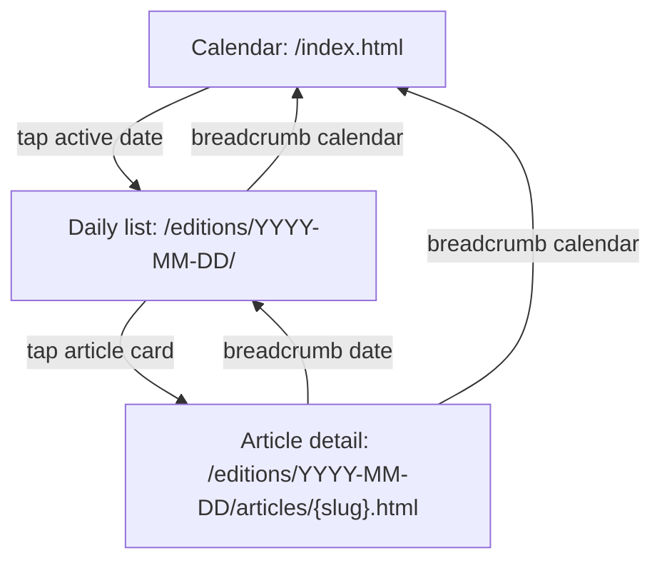
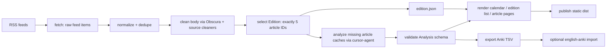

# English News Digest Redesign Design Doc

Date: 2026-06-09

## 1. Executive Summary

English News Digest should be rebuilt around a daily `Edition`: one date, exactly five selected articles, and one learning-focused detail screen per article. The user journey stays intentionally small: calendar, day list, article detail. The most important design decision is to guarantee five daily learning slots by filling shortages with recent unassigned articles, while clearly recording each article's original publication date. Deep-dive sentence/chunk explanation should not be a separate page; it should be the primary expandable layer inside the article detail screen. The pipeline should be split into fetch, clean, select, analyze, render, export, and publish modules so that a failed AI call or stale cache cannot silently corrupt a daily edition.

## 2. User journeys

Morning flow:

1. Open `dist/index.html` on iPhone or desktop.
2. See the monthly calendar. Days with completed editions are active; today is highlighted.
3. Tap today's date.
4. See exactly five article cards for that date.
5. Pick one article based on title, source, Japan/World label, and short Japanese summary.
6. Read the article detail screen sentence by sentence.
7. Expand difficult sentences for chunk-level explanation when needed.
8. Optionally use exported Anki TSV later; the reading flow itself does not ask the user to manage Anki.

Design implication: the app should answer "What do I read today?" immediately after opening a day. It should not expose build state, raw RSS volume, or normal/deep implementation modes to the learner.

## 3. Information Architecture

### Three screens

1. Calendar
   - Responsibility: choose a date.
   - Shows: month grid, active edition days, today highlight, build status badge per day if useful.
   - Does not show: article body, learning notes, RSS source diagnostics.

2. Daily article list
   - Responsibility: choose one of the day's five learning articles.
   - Shows: exactly five article cards, source, category, source date if different from edition date, Japanese summary, original link.
   - Does not show: full sentence analysis.

3. Article detail
   - Responsibility: read and study one article.
   - Shows: original English sentences, Japanese translation, B2 grammar note, expandable chunk/deep-dive layer, vocabulary, grammar points, original source link.
   - Does not expose: separate normal/deep URLs as a product concept.

### URL structure

Recommended static URL layout:

```text
dist/
  index.html
  calendar.json
  editions/
    2026-06-09/
      index.html
      edition.json
      articles/
        01-memorial-service-marks-25-years-since-fatal-stabbing-rampage.html
        02-deteriorating-castles-in-japan-face-high-costs-debates-over-renovation.html
```

Compatibility redirects may be generated for the current paths:

```text
dist/days/2026-06-09.html -> dist/editions/2026-06-09/index.html
dist/articles/2026-06-09/{slug}.html -> dist/editions/2026-06-09/articles/{slug}.html
```

Do not keep `.deep.html` as a user-facing concept.

### Screen transition diagram



## 4. Data model

Use `Edition` as the completion unit. An edition is not "all articles published today"; it is "the five articles assigned to this learning day."

### Edition

```json
{
  "edition_date": "2026-06-09",
  "status": "complete",
  "target_article_count": 5,
  "actual_article_count": 5,
  "selection_policy": "balanced-five-fill-with-recent-unassigned",
  "source_window": {
    "primary_date": "2026-06-09",
    "fallback_days": 3
  },
  "category_counts": {
    "japan": 3,
    "world": 2
  },
  "articles": ["article_id_1", "article_id_2"],
  "generated_at": "2026-06-09T07:15:00+09:00",
  "warnings": []
}
```

### Article

```json
{
  "article_id": "japantoday:2026-06-08:memorial-service-marks-25-years",
  "edition_date": "2026-06-09",
  "source_published_date_jst": "2026-06-08",
  "source": "Japan Today",
  "source_url": "https://...",
  "title": "...",
  "slug": "01-memorial-service-marks-25-years",
  "category": "japan",
  "selection_rank": 1,
  "selection_reason": "japan_primary_recent",
  "body_clean_status": "clean",
  "analysis_status": "complete"
}
```

### Analysis

Analysis belongs to an `article_id` and may be reused across editions if the same article is assigned later. The edition decides order and membership; the analysis cache stores learning content.

```json
{
  "article_id": "japantoday:2026-06-08:memorial-service-marks-25-years",
  "schema_version": 2,
  "analysis_level": "standard_with_deep_chunks",
  "summary_ja": "...",
  "sentences": [],
  "vocabulary": [],
  "grammar_points": [],
  "quality": {
    "sentence_count": 14,
    "noise_flags": [],
    "ai_model": "cursor-agent default",
    "generated_at": "2026-06-09T07:10:00+09:00"
  }
}
```

### CalendarIndex

```json
{
  "editions": {
    "2026-06-09": {
      "status": "complete",
      "article_count": 5,
      "japan_count": 3,
      "world_count": 2,
      "path": "editions/2026-06-09/index.html",
      "generated_at": "2026-06-09T07:15:00+09:00"
    }
  }
}
```

## 5. Article selection algorithm

### Recommendation

Use option 3: always five articles, filling shortages with recent unassigned articles.

Reason: the user wants a stable daily learning ritual. A day list with three items breaks the product promise, while build failure for fewer than five same-day articles is too brittle for free RSS sources. Filling from recent unassigned articles preserves "five learning slots" without pretending every article was published on the edition date.

### Selection policy

Policy name: `balanced-five-fill-with-recent-unassigned`.

1. Fetch candidate articles from all feeds.
2. Normalize each item into canonical `article_id`.
3. Dedupe by canonical URL first, then normalized title.
4. Exclude already assigned articles unless rebuilding the same edition.
5. Build a candidate pool:
   - primary pool: published on `edition_date` in JST.
   - fallback pool: unassigned articles from the previous 3 JST days.
6. Score candidates.
7. Select exactly five.
8. Freeze the selected IDs into `edition.json`.

### Category mix

Recommended target:

```text
Japan: 3
World: 2
```

Fallback rules:

1. Prefer Japan 3 / World 2.
2. If World has fewer than 2 valid candidates, use Japan to fill.
3. If Japan has fewer than 3 valid candidates, use World to fill.
4. If all sources combined still have fewer than 5 valid candidates in the 3-day fallback window, create an `incomplete` edition and do not publish it as complete.

Why this mix: the product's core is Japan-related English news, but World items prevent the feed from becoming too narrow and provide broader vocabulary. The 2026-06-09 sample already shows that World can be zero after JST filtering, so the rule must degrade gracefully.

### Candidate scoring

Suggested score:

```text
score =
  source_priority
  + category_fit_bonus
  + recency_bonus
  + title_quality_bonus
  - duplicate_topic_penalty
  - long_article_penalty
  - noisy_source_penalty
```

Initial source priority:

```text
Japan Today: high for Japan category
BBC: high for World and Asia
Guardian: medium, because articles may be longer
```

Do not select articles that fail body extraction or cleaning quality checks unless there are no alternatives.

## 6. Pipeline architecture

Split the current `build_learning.py` into modules with one clear owner per stage.

```text
english_news_digest/
  feeds.py          # RSS fetch, source definitions
  normalize.py      # URL/title normalization, article_id, dedupe
  clean.py          # body extraction and source-specific cleaners
  select.py         # edition selection, scoring, five-article guarantee
  analyze.py        # cursor-agent prompts and analysis cache
  schemas.py        # dataclasses / JSON schema validation
  render/
    calendar.py
    edition.py
    article.py
    assets.py
  anki.py           # TSV export and optional import
  publish.py        # local file output / future static hosting
  cli.py            # build commands
```

### Data flow diagram



### CLI commands

Recommended:

```bash
python3 -m english_news_digest build-edition --date 2026-06-09
python3 -m english_news_digest render --date 2026-06-09
python3 -m english_news_digest export-anki --date 2026-06-09
python3 -m english_news_digest import-anki --date 2026-06-09
python3 -m english_news_digest rebuild-calendar
```

`build-edition` should be the normal command. It should call fetch, clean, select, analyze, render, and export in order, but the internal modules remain testable separately.

## 7. Caching & idempotency

### Principle

Rebuilding the same complete edition should not change article membership unless the user passes an explicit reselection flag.

### Recommended cache layout

```text
data/
  raw_feed/YYYY-MM-DD.json
  bodies/{article_id}.txt
  analyses/v2/{article_id}.json
  editions/YYYY-MM-DD/edition.json
  build_logs/YYYY-MM-DD.json
```

### Rebuild behavior

Default `build-edition --date D`:

1. If `edition.json` exists and status is `complete`, reuse its five article IDs.
2. Reuse body and analysis caches if schema versions match.
3. Re-render HTML and Anki TSV.
4. Update `calendar.json` only after render succeeds.

Explicit `--reselect`:

1. Move old `edition.json` to `edition.previous.json`.
2. Re-run selection.
3. Preserve analysis caches for reused articles.

Explicit `--refresh-analysis`:

1. Keep selected article IDs.
2. Re-run AI analysis.
3. Keep the old analysis as backup until new schema validation passes.

This avoids the current state where `data/` has nine analyzed articles while `dist/` has five pages with unclear membership.

## 8. Content schema

### Recommendation

Unify normal and deep-dive analysis in one schema. Treat deep-dive content as optional per sentence, not as a separate article mode.

```json
{
  "schema_version": 2,
  "summary_ja": "...",
  "reading_level": "B2",
  "sentences": [
    {
      "sentence_id": "s001",
      "text": "A memorial service was held Sunday...",
      "translation_ja": "...",
      "grammar_ja": "...",
      "chunks": [
        {
          "text": "A memorial service",
          "role_ja": "主語",
          "literal_ja": "追悼式が",
          "note_ja": "..."
        }
      ],
      "deep_dive_ja": "...",
      "difficulty": "medium"
    }
  ],
  "vocabulary": [
    {
      "word": "memorial service",
      "pronunciation": "/məˈmɔːriəl ˈsɜːrvɪs/",
      "meaning_ja": "追悼式",
      "example": "A memorial service was held Sunday.",
      "example_ja": "日曜日に追悼式が行われた。",
      "source_sentence_id": "s001"
    }
  ],
  "grammar_points": [
    {
      "id": "news-2026-06-09-01-passive",
      "title": "受動態の報道表現",
      "rule": "...",
      "example": "...",
      "meaning_ja": "..."
    }
  ]
}
```

### UI handling

Article detail should show:

1. Sentence text.
2. Japanese translation visible by default.
3. B2 grammar memo visible by default or one tap away.
4. Chunk/deep-dive area collapsed by default, opened per sentence.

This makes deep-dive a core capability without forcing the user to choose between normal and deep versions. It also allows cost control: some articles or sentences may have richer chunks while the UI stays the same.

## 9. Anki export spec

Keep the existing `english-anki` TSV workflow. It is already aligned with the user's low-friction English system and should not be replaced in this redesign.

### Output files

```text
english-anki/materials/news-digest/batches/
  2026-06-09-vocabulary.tsv
  2026-06-09-grammar.tsv
```

### Vocabulary TSV

Required columns remain:

```text
word	pronunciation	meaning	example	unit	note
```

Mapping:

```text
unit = edition_date
note = news:{article_slug} | sentence:{sentence_id} | {example_ja}
```

### Grammar TSV

Required columns remain:

```text
id	title	rule	example	unit	note
```

Mapping:

```text
id = stable grammar id from analysis
unit = edition_date
note = news:{article_slug} | source:{source}
```

### Dedupe policy

Do not dedupe aggressively inside the digest app. Export all edition candidates with stable IDs and source notes. Let `english-anki` remain the import and dedupe authority because its `materials.json` already defines `dedupe_key`.

Recommended app-side soft dedupe:

1. Within one edition, keep only the best duplicate vocabulary item by exact lowercased `word`.
2. Across days, export again if the example sentence is useful; rely on `english-anki` to skip or update based on its policy.

### Import policy

Default: export TSV automatically, import manually.

Reason: automatic Anki import can add friction and hidden failure modes. The learning app should produce clean daily materials; importing into Anki can remain an explicit step until the pipeline is stable.

## 10. Error handling & partial failure

### Edition status

Use explicit statuses:

```text
draft       selection in progress
selected    five article IDs frozen, analysis not complete
complete    render and Anki export succeeded
failed      cannot produce a valid edition
```

### Failure rules

1. RSS fetch fails:
   - Use cached recent feed items if available.
   - Mark build log with `feed_cache_used`.

2. Body extraction fails for one article:
   - Replace it with the next scored candidate before selection is frozen.

3. Cleaner detects noise:
   - Mark `body_clean_status = suspect`.
   - Prefer a different candidate.
   - If used, show a build warning but do not show warning in the learner UI by default.

4. AI analysis fails:
   - Retry once.
   - If still failed before edition completion, replace the article if candidates remain.
   - If no candidates remain, keep edition as `selected` and do not publish as `complete`.

5. Render fails:
   - Do not update `calendar.json`.
   - Keep prior complete edition visible if it exists.

6. Anki export fails:
   - Article pages can still publish, but edition should include a warning in `build_logs`.
   - Do not block the reading UI solely because Anki export failed.

### Observability

Write one build log per edition:

```json
{
  "edition_date": "2026-06-09",
  "started_at": "...",
  "finished_at": "...",
  "stage_counts": {
    "fetched": 16,
    "body_clean": 12,
    "selected": 5,
    "analyzed": 5,
    "rendered": 5
  },
  "warnings": [],
  "errors": []
}
```

## 11. MVP scope vs Phase 2

### MVP

1. Calendar -> daily list -> article detail.
2. `Edition` model with exactly five selected articles.
3. Fallback selection from recent unassigned articles.
4. Unified article detail page with expandable deep-dive chunks.
5. Static HTML output.
6. Existing Anki TSV export preserved.
7. Build logs and explicit edition status.
8. Source-specific cleaner for Japan Today improved enough to remove known footer/ad/social noise.

### Phase 2

1. VPS cron on `llm-devbox`.
2. Cloudflare Pages or another static host for iPhone access.
3. Parallel AI analysis with rate-limit control.
4. Long-article chunked prompting.
5. Topic diversity controls.
6. Article quality dashboard for build diagnostics.
7. Optional automatic Anki import after TSV stability is proven.

Do not add accounts, login, read-state sync, or speaking/writing practice UI in this redesign.

## 12. Migration from current prototype

### Keep

1. RSS source definitions from `build_digest.py`.
2. Current static HTML approach.
3. Obscura for JS-rendered body extraction.
4. cursor-agent based analysis.
5. Existing analysis fields: `summary_ja`, `sentences`, `vocabulary`, `grammar_points`.
6. Existing Anki TSV format and `english-anki` integration.
7. Calendar/day/detail navigation skeleton.

### Change

1. Replace "today's all RSS items plus `--limit`" with explicit edition selection.
2. Replace `.deep.json` and `.deep.html` split with schema version 2 unified analysis.
3. Move rendering out of `build_learning.py` into screen-specific render modules.
4. Treat `calendar.json` as an index of complete editions only.
5. Stop publishing partial day pages as if they were complete.
6. Move old date-less `dist/articles/*.html` into archive or delete during migration.

### Suggested migration steps

1. Introduce schemas and cache directories without changing output.
2. Implement article ID normalization and selection.
3. Build `edition.json` for 2026-06-09 from the current five rendered articles.
4. Render the new `dist/editions/2026-06-09/` structure.
5. Add compatibility redirects or links from old paths.
6. Remove `.deep.html` generation after unified detail page is verified.
7. Split modules from `build_learning.py` one responsibility at a time.

## 13. Open risks

1. Source shortage:
   - Free RSS feeds may not supply five clean articles in the fallback window.
   - Mitigation: fallback window, candidate replacement, and explicit incomplete status.

2. Japan Today noise:
   - Current cleaner lets footer/ad/social text into the learning content.
   - Mitigation: source-specific stop phrases, body length checks, and suspect flags before AI analysis.

3. AI cost and latency:
   - Deep-dive for all five articles can take 10-25 minutes.
   - Mitigation: cache by article ID, unified schema, retry only missing analysis, later parallelism.

4. Long BBC/Guardian articles:
   - Very long articles may produce slow or uneven analysis.
   - Mitigation: initial length penalty in selection and Phase 2 chunked prompting.

5. Hidden drift between data and dist:
   - Current partial builds leave stale files.
   - Mitigation: edition status, atomic render directory, update calendar only after success.

6. Overbuilding the learning system:
   - The user's English plan prioritizes low friction.
   - Mitigation: keep this app as Input + Language Focus only; do not add tracking, speaking, or writing workflows.

7. Privacy and external AI:
   - Article body is sent to cursor-agent.
   - Mitigation: document this in developer docs; avoid sending user-private data because the app processes public articles only.

## 14. Appendix: screen wires

### Calendar

```text
+------------------------------------------------+
| English News Digest                 June 2026  |
| < May                                  July >  |
+------------------------------------------------+
| Mon | Tue | Wed | Thu | Fri | Sat | Sun        |
|  1  |  2  |  3  |  4  |  5  |  6  |  7        |
|  8  | [9] | 10  | 11  | 12  | 13  | 14        |
|     | 5   |     |     |     |     |           |
+------------------------------------------------+

[9] = today
5   = completed edition with five articles
```

### Daily article list

```text
Calendar < 2026-06-09

Today's five articles
Japan 3 / World 2

1. Memorial service marks 25 years...
   Japan Today | Japan | source date: Jun 8
   大阪府池田市の小学校事件から25年...
   [Open article] [Original]

2. Deteriorating castles in Japan...
   Japan Today | Japan | source date: Jun 9
   ...

...
```

If a fallback article is used, show a quiet label:

```text
Source date: Jun 8
```

Do not label it as a failure.

### Article detail

```text
Calendar < 2026-06-09 < Memorial service marks 25 years...

Source: Japan Today    Category: Japan    Original article

Summary
大阪府池田市の小学校で起きた...

Sentence 1
A memorial service was held Sunday to mark...

日本語訳
大阪府池田市の小学校で起きた...

B2 grammar note
受動態の単文で、to mark 以下が目的...

[Show chunk explanation]
  A memorial service       主語          追悼式が
  was held Sunday          述語          日曜日に行われた
  to mark...               目的          25周年を記念するために

Vocabulary
- memorial service
- stabbing rampage
- observe a moment of silence

Grammar points
- Passive voice in news reporting
- Relative clauses after event nouns
```

### Final design decisions

| Topic | Recommendation |
| --- | --- |
| 1日5件 | Always five, fill with recent unassigned articles; incomplete only if the fallback window cannot supply five clean articles |
| 内訳 | Target Japan 3 / World 2, degrade gracefully |
| 深掘り | Same article page, per-sentence expandable chunk layer |
| Build unit | Edition is the atomic completion unit |
| Cache | Article analysis cache reused across editions; edition membership frozen |
| Anki | Keep TSV export and english-anki import path; manual import by default |
| Publish | MVP local static HTML; Phase 2 static hosting for iPhone |
